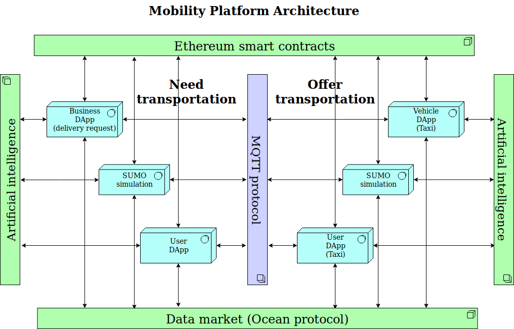
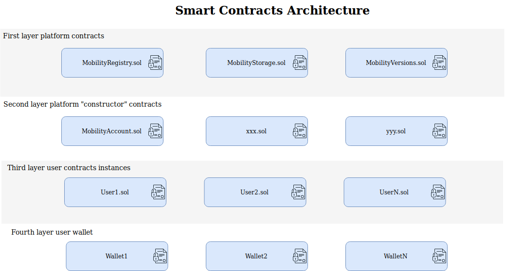

# Mobility Platform  

### About the project
Inspired from and for the [Mobi Grand Challenge](https://mobihacks.devpost.com/).  
Goal is to make a mobility platform what will represent the point where different tehnologies can intersect. It can be used for testing, simulation and production.  

### Tehnologies
- [Ethereum](https://www.ethereum.org/) - Decentralized platform that runs smart contracts
- [React](https://reactjs.org/) - JavaScript library for building user interfaces
- [SUMO](http://sumo.dlr.de/index.html) - Simulation of Urban MObility
- [MQTT](http://mqtt.org/) - Machine-to-machine (M2M) "Internet of Things" connectivity protocol
- [web3.js](https://web3js.readthedocs.io/en/1.0/) - Ethereum JavaScript API
- [web3.py](https://web3py.readthedocs.io/en/stable/) - Ethereum Python API
- [Solidity](https://solidity.readthedocs.io/en/latest/) - Contract-oriented programming language for writing smart contracts
- [MetaMask](https://metamask.io/) - Browser plugin that allows you to run Ethereum dApps in your browser without running a full Ethereum node
- [ocean protocol](https://oceanprotocol.com/) - A protocol and network, on which data marketplaces can be built

### Structure of the repository
Simulation DApp sources: [./](./)  
- main app: [runner.py](./runner.py)  

Web DApp sources: [./web/mqttMaps](./web/mqttMaps/)  
- main app: [MqttMap.js](./web/mqttMaps/src/MqttMap.js)  

Ethereum sources: [./web/mqttMaps/src/ethereum/](./web/mqttMaps/src/ethereum)  
- contracts: [DecentralizedMobilitySystem_V01.sol](./web/mqttMaps/src/ethereum/contracts/DecentralizedMobilitySystem_V01.sol)

### Arhitecture

### Description of architecture
#### 1. Ethereum smart contracts  
Ethereum smart contracts where are all the rules and users are stored and ready for interaction.  

**1.1** In the first layer are the contracts that set the rules for the platform and store the data. Functional part and storage part are seperated, so if there is a need for critical functionality update of the platform, only **MobilityRegistry.sol** is updated and with the consensus the address of the new version of the contract is pushed and stored in the **MobilityStorage.sol**. and have permissions to interect with the storage contract. MobilityVersions stores addresses of updated **MobilityRegistry.sol** contracts, so DApps can ask for the address of the latest version.  

Deployed smart contracts on the Rinkeby Ethereum test net:  

**MobilityVersions**: 0xd067c87b3a4f7fd82542e4e6884d6e34d80de7de   
**MobilityStorage**: 0xed65fce4eac8430631b2b3f1d449c5c1d115c17e  
**MobilityRegistry**: 0x273532806a1d3a38197Ba46358Ea5eED756de7C1  

**1.2** Second layer consist of "constructor" smart contracts.  
For now **MobilityAccount.sol** is the only one. Owner is the wallet that created the instance through the **MobilityRegistry** contract. In the contract are the function like payRide, setDistance, getDistance, getIsPaid... 

**1.3** sdfsdf   

**Monetization**:  
Every contract has the funciton ownerRetriveDonations(address receiver), that can be executed at any time by the owner of the contract (the wallet that was used for creating the contract instance).
For the monetization testing was implemented functionality in the MobilityAccount that sends received_amount/10 to the MobilityStorage contract, the rest stays on the MobilityAccount contract instance.   
At the moment the amount the price for transportation request is hardcoded in the MobilityAccount contract (0.01 ether/km). But can be upgraded that can be changed by the owner of the contract instance.  

** If there is a platform desire to have a very small percentage income from the transactions, than upgrade is needed. Becouse of the immutability reasons, reciving function must be implemented in the first layer contract, which forwards calculated amount to the MobilityAccount contract instance. sends whole amount to MobilityRegistry contract and the defined percentage is returend.  

#### 2. DApp  
DApp (Decentralized application), that can be used in two modes:  
1. Requesting a ride
2. Offer a ride  
	2.1 Mobile application (real user)  
	2.2 Embedded application (autonomous vehicle)  
	2.3 SUMO application (simulation)

1. Requesting a ride  
source code: destination link  
info:  
Enter destination and from available offers pick the one that is fastest or cheapest. Watch where  
2. Offer a ride   
2.1 source code: destination link  
info:  
2.2 source code: destination link  
info:  
2.3 source code: destination link  
info:  
nekaj o samovozečih avtomobilih in mehkemu prehodu z uporabo dapp-a, ki bo 
testiranje avtomatizirianih križišč ()

### Usage

Demo DApp: http://www.mobi-dapp.com

### Video

### TO-DO

### Author
Primož Zajec  
[@115Primus](https://twitter.com/115primus)

